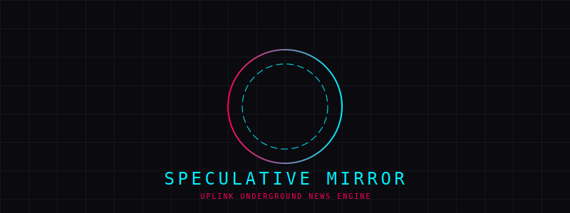

# 📡 Uplink Underground: Speculative Mirror
> "Turning the world's noise into the city's propaganda."

Speculative Mirror is a "Dystopian Translation" engine that ingests real-world OSINT data and transmutes it into immersive chronicles of a cyberpunk future. It is not just a news aggregator; it is a lens that refracts reality through neon, crisis, and chrome.



---

## The "Speculative Mirror" Logic

At its core, the application utilizes the Dystopian Translator engine to process raw information into atmospheric storytelling:

1. **Data Ingestion (OSINT)**
   Using a mapping interface and location-based coordinates, the system scrapes real-world news from Google Search and local feeds. Reality is our raw material.

2. **Narrative Synthesis**
   Leveraging LLM logic, the engine maps economic or social data into a "High-Tech, Low-Life" context.
   * *Example:* A "boring" interest rate hike is reframed as an "Iron Vault Credit Tax" imposed on the city's neon districts.

3. **Persona-Driven Interpretation**
   Users select different Speaker Profiles that dictate the bias and tone of the report:
   * **X-7 "REBEL" AI**: Anarchist, aggressive, and anti-corporate tone.
   * **ARASAKA-VOX 900**: Clean, cold, and authoritarian corporate propaganda.

---

## Artistic & Technical Layer

### Procedural Audio & Sentiment Sync
The experience is sensory. The system features a dynamic audio engine that reacts to the news data:
- **Real-Time Synthesis:** Generates synthwave or industrial tracks on the fly.
- **Dynamic Tuning:** Track parameters—such as tempo, filter resonance, and distortion—are tuned based on the Sentiment Analysis (Aggressive, Melancholy, Corporate, etc.) of the current news stream.

---

## Technical Stack

- **Architecture:** React / Vite / TypeScript
- **Narrative Engine:** Google Gemini (via `@google/genai`)
- **Interface:** CRT Terminal / D3.js / Leaflet
- **Styling:** Lucide React / CSS Modules

---

## Quick Start

1. **Install dependencies:**
   ```bash
   npm install
   ```

2. **Configure Environment:**
   You can provide your Gemini API key in two ways:
   - **Runtime (Recommended):** Just run the app, and you will be prompted to enter your key securely. It is stored in your local browser storage and is not shared with any server other than Google's.
   - **Dev Mode:** Set `VITE_GEMINI_API_KEY` in `.env` (or `.env.local`) to your key. This will auto-fill the key for local development.

3. **Start the transmission:**
   ```bash
   npm run dev
   ```

4. **Establish Uplink:**
   Open the application in your browser. If you didn't provide a key in `.env`, you will be prompted to enter your **Gemini API Key** to start the neural transmission.

---

*Developed for those who prefer their truth wrapped in neon.*
